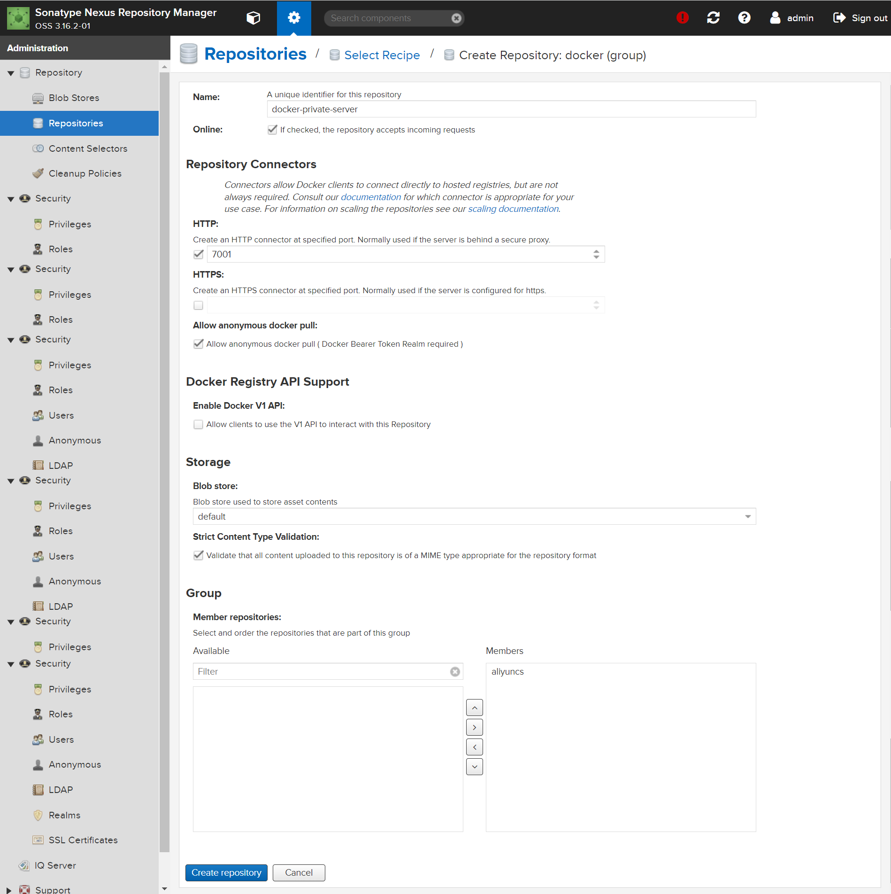
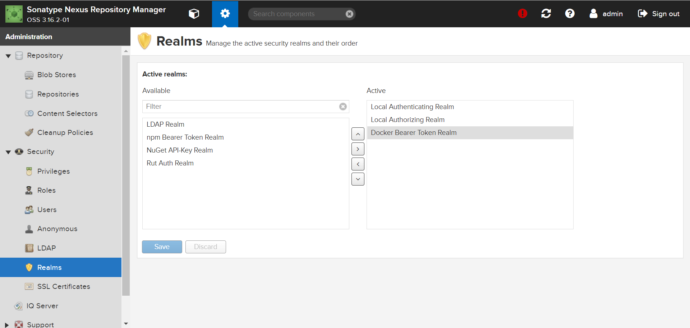
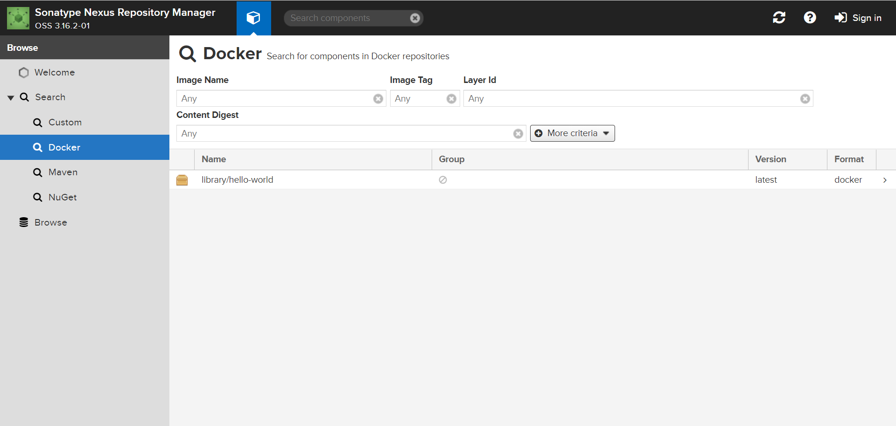

# 摘要

# nexus3 配置

## docker (proxy)

1. Name：随意，我这里填 aliyuncs
2. 勾选 **Allow anonymous docker pull** 
3. 填写 Remote storage : https://6kx4zyno.mirror.aliyuncs.com


## docker (group)

1. Name：随意，我这里填 docker-private-server
2. HTTP : 暴露的端口，我这里填 7001
3. 勾选 **Allow anonymous docker pull** 
4. Member repositories : 添加刚才创建的 aliyuncs



## Docker Bearer Token Realm



# 使用者配置

```sh
# 配置域名，方便与 IP 地址解耦
echo "192.168.0.10 ps" >> /etc/hosts

# 添加镜像
tee /etc/docker/daemon.json <<-'EOF'
{
  "registry-mirrors": ["http://ps:7001"],
  "insecure-registries": ["ps:7001"]
}
EOF

# 重启
systemctl daemon-reload
systemctl restart docker
```

使用 `docker info` 可以检查是否成功配置：

```
 Insecure Registries:
  ps:7001
  127.0.0.0/8
 Registry Mirrors:
  http://ps:7001/
```

# 测试

```sh
docker pull hello-world
```

拉取镜像后可见：




# 测试

## 加入授信列表

别忘了修改 **nexus3-ip** 为自己的 nexus3 IP

```sh
tee /etc/docker/daemon.json <<-'EOF'
{
  "insecure-registries": ["nexus3-ip:7001"]
}
EOF

# 重启
systemctl daemon-reload
systemctl restart docker
```

## 登录

```sh
docker login -u admin -p admin123 nexus3-ip:7001
```

## push 

- push 前记得登录
- 别忘了修改 **nexus3-ip** 为自己的 nexus3 IP

```sh
docker pull hello-world
docker tag hello-world:latest nexus3-ip:7001/my-hello-world:1.0
docker push nexus3-ip:7001/my-hello-world:1.0
```


# 参考

 [利用nexus作为私库进行代理docker,进行上传和下载镜像操作.html](assets\references\利用nexus作为私库进行代理docker,进行上传和下载镜像操作.html) 


