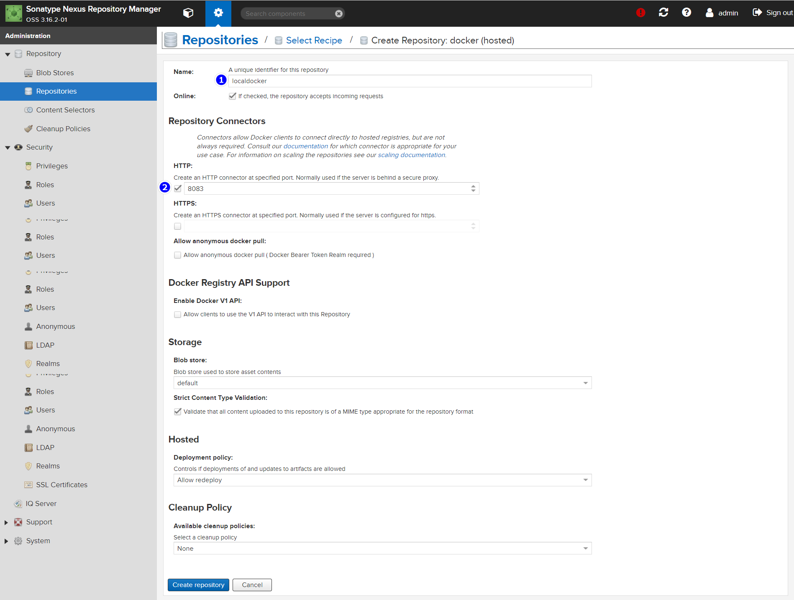

# 摘要


# 运行

```sh
docker container rm -f nexus3
rm -rf /docker-v/nexus3/
mkdir -p /docker-v/nexus3/nexus-data
chmod 777 -R /docker-v/nexus3/
docker run -itd  -p 7000:8081 -p 7001-7100:7001-7100 -v /docker-v/nexus3/nexus-data:/nexus-data --privileged=true --restart=always --name=nexus3 sonatype/nexus3:3.16.2
watch docker logs nexus3
```

# 访问

- 路径： http://nexus3-ip:7000/
- 账号：admin
- 密码：admin123

# Create repository



# 测试

## 加入授信列表

别忘了修改 **nexus3-ip** 为自己的 nexus3 IP

```sh
tee /etc/docker/daemon.json <<-'EOF'
{
  "insecure-registries": ["nexus3-ip:8081"]
}
EOF

# 重启
systemctl daemon-reload
systemctl restart docker
```

## 登录

```sh
docker login -u admin -p admin123 nexus3-ip:8083
```

## push 

- push 前记得登录
- 别忘了修改 **nexus3-ip** 为自己的 nexus3 IP

```sh
docker pull hello-world
docker tag hello-world:latest nexus3-ip:8083/my-hello-world:1.0
docker push nexus3-ip:8083/my-hello-world:1.0
```

# 其他模式介绍

 [Nexus3搭建Docker等私服.html](assets\references\Nexus3搭建Docker等私服.html) 


