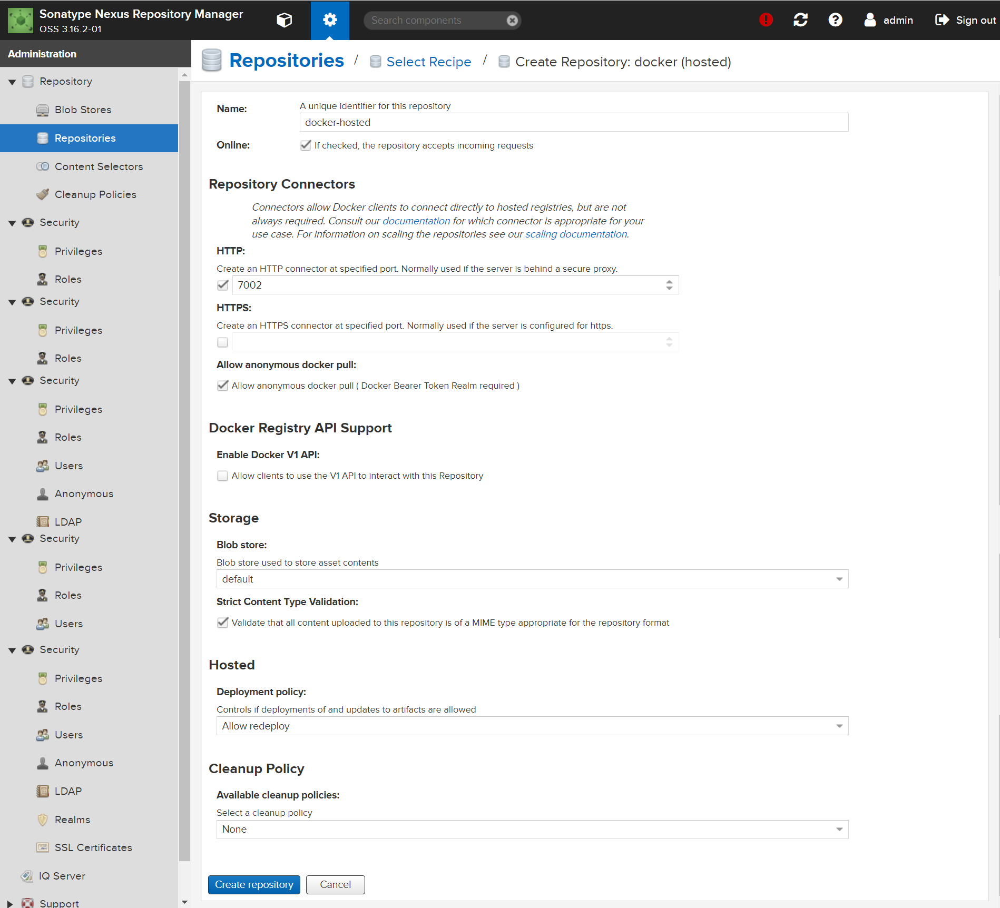

# 摘要

# nexus3 配置

## docker (proxy)

1. Name：随意，我这里填 aliyuncs，你也可以填 docker-proxy-aliyuncs.com
2. 勾选 **Allow anonymous docker pull** 
3. 填写 Remote storage : https://6kx4zyno.mirror.aliyuncs.com


如果你想代理更多，多加几个，都是一样的步骤：

| name                                           | Remote storage                            |
| ---------------------------------------------- | ----------------------------------------- |
| docker-proxy-gcr.io                            | https://gcr.io                            |
| docker-proxy-registry.aliyuncs.com             | https://registry.aliyuncs.com             |
| docker-proxy-registry.cn-hangzhou.aliyuncs.com | https://registry.cn-hangzhou.aliyuncs.com |

## docker (hosted)

1. Name：随意，我这里填 docker-hosted
2. HTTP : 暴露的端口，我这里填 7002
3. 勾选 **Allow anonymous docker pull** 



## docker (group)

1. Name：随意，我这里填 docker-private-server
2. HTTP : 暴露的端口，我这里填 7001
3. 勾选 **Allow anonymous docker pull** 
4. Member repositories : 添加刚才创建的 aliyuncs、docker-hosted 


## Docker Bearer Token Realm


# 使用者配置

```sh
# 配置域名，方便与 IP 地址解耦
echo "192.168.0.10 ps" >> /etc/hosts

# 添加镜像、加入授信列表
tee /etc/docker/daemon.json <<-'EOF'
{
  "registry-mirrors": ["http://ps:7001"],
  "insecure-registries": ["ps:7002"]
}
EOF

# 重启
systemctl daemon-reload
systemctl restart docker
```

使用 `docker info` 可以检查是否成功配置：

```
 Insecure Registries:
  ps:7002
  127.0.0.0/8
 Registry Mirrors:
  http://ps:7001/
```

# 测试

## 代理测试

```sh
docker pull hello-world
```

拉取镜像后可见：


## push 测试

```sh
# 登录 
docker login -u admin -p admin123 ps:7002
# push 测试
docker pull hello-world
docker tag hello-world:latest ps:7002/my-hello-world:1.0
docker push ps:7002/my-hello-world:1.0
# 删除本地镜像
docker image rm -f  ps:7002/my-hello-world:1.0
# pull 测试
docker pull ps:7002/my-hello-world:1.0
```

# 参考

 [利用nexus作为私库进行代理docker,进行上传和下载镜像操作.html](assets\references\利用nexus作为私库进行代理docker,进行上传和下载镜像操作.html) 

 [使用nexus3.x配置docker镜像仓库及仓库代理.html](assets\references\使用nexus3.x配置docker镜像仓库及仓库代理.html) 


# 本人常用 docker 镜像

```sh

docker pull calico/node:v3.21.2
docker pull calico/pod2daemon-flexvol:v3.21.2
docker pull calico/cni:v3.21.2
docker pull calico/kube-controllers:v3.21.2
docker pull registry.aliyuncs.com/google_containers/kube-proxy:v1.20.9
docker pull kubesphere/ks-controller-manager:v3.1.1
docker pull kubesphere/ks-apiserver:v3.1.1
docker pull kubesphere/ks-console:v3.1.1
docker pull redis:5.0.12-alpine
docker pull kubespheredev/openpitrix-jobs:v3.1.1
docker pull kubesphere/ks-jenkins:2.249.1
docker pull kubesphere/fluent-bit:v1.6.9
docker pull jettech/kube-webhook-certgen:v1.5.1
docker pull kubesphere/kube-rbac-proxy:v0.8.0
docker pull istio/proxyv2:1.6.10
docker pull istio/pilot:1.6.10
docker pull osixia/openldap:1.3.0
docker pull lizhenliang/nginx-ingress-controller:0.30.0
docker pull google_containers/pause:3.2
docker pull registry.cn-hangzhou.aliyuncs.com/google_containers/pause:3.2
docker pull kubesphere/elasticsearch-oss:6.7.0-1
docker pull prom/node-exporter:v0.18.1
```


