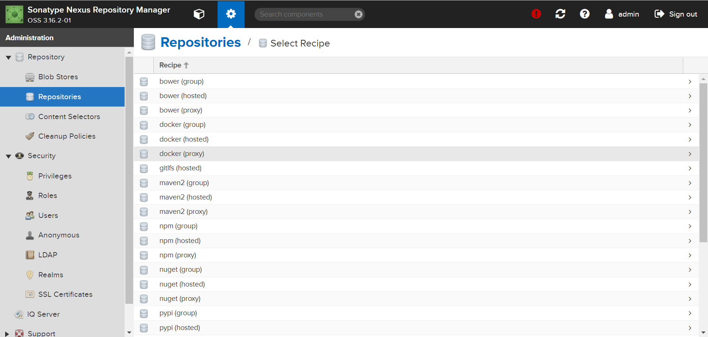
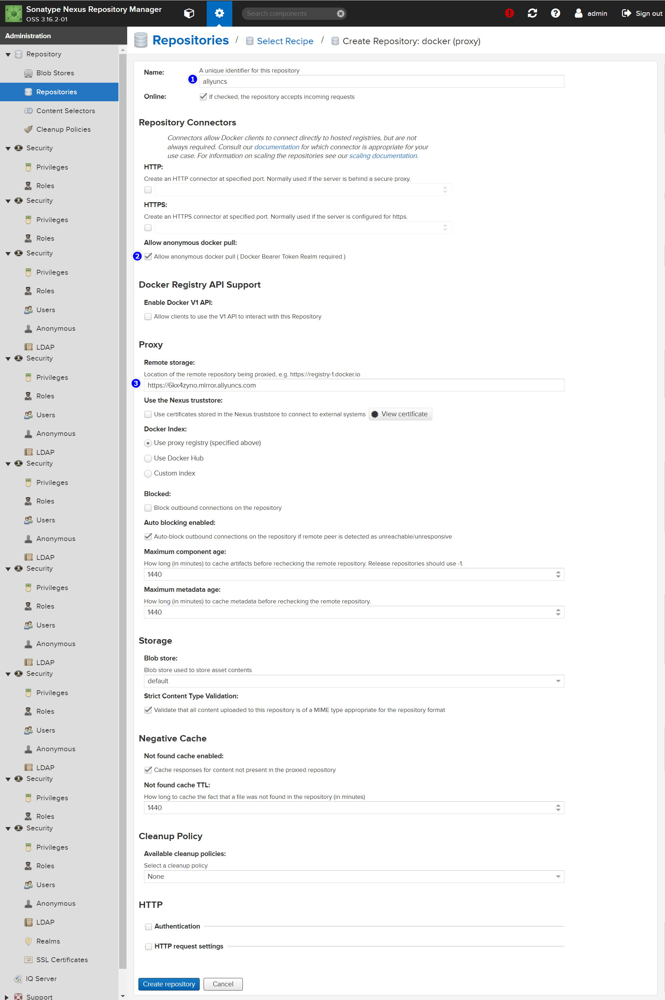
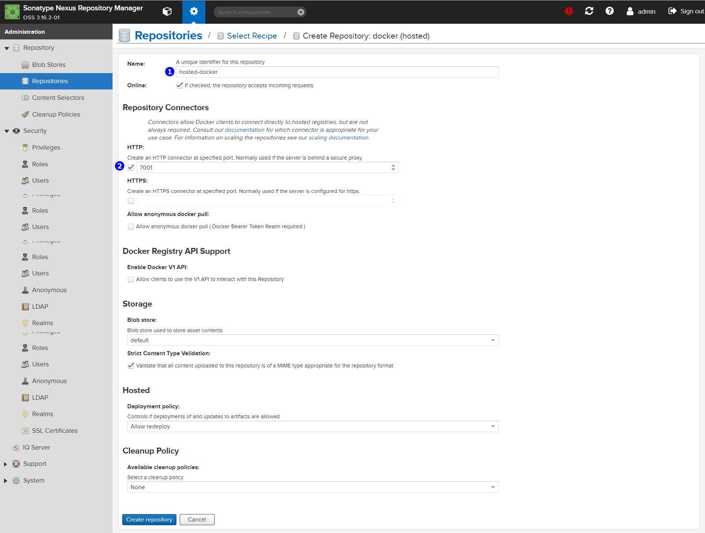

# 摘要

# 实现步骤

## docker (proxy)

### Create Repository: docker (proxy)

创建一个 docker 代理仓库



### 填写

1. Name：随意，我这里填 aliyuncs
2. 勾选 **Allow anonymous docker pull** 
3. 填写 Remote storage : https://6kx4zyno.mirror.aliyuncs.com 




# Create repository



# 测试

## 加入授信列表

别忘了修改 **nexus3-ip** 为自己的 nexus3 IP

```sh
tee /etc/docker/daemon.json <<-'EOF'
{
  "insecure-registries": ["nexus3-ip:7001"]
}
EOF

# 重启
systemctl daemon-reload
systemctl restart docker
```

## 登录

```sh
docker login -u admin -p admin123 nexus3-ip:7001
```

## push 

- push 前记得登录
- 别忘了修改 **nexus3-ip** 为自己的 nexus3 IP

```sh
docker pull hello-world
docker tag hello-world:latest nexus3-ip:7001/my-hello-world:1.0
docker push nexus3-ip:7001/my-hello-world:1.0
```

# 其他模式介绍

 [Nexus3搭建Docker等私服.html](assets\references\Nexus3搭建Docker等私服.html) 


# 代理

```
http://ps:7000/repository/docker-private-server/
```


```sh
echo "192.168.0.10  ps" >> /etc/hosts

# 加入信任列表
tee /etc/docker/daemon.json <<-'EOF'
{
  "registry-mirrors": ["http://ps:7001"],
  "insecure-registries": ["ps:7001"]
}
EOF

# 重启
systemctl daemon-reload
systemctl restart docker
```


```
docker info 
```


 [利用nexus作为私库进行代理docker,进行上传和下载镜像操作.html](assets\references\利用nexus作为私库进行代理docker,进行上传和下载镜像操作.html) 


