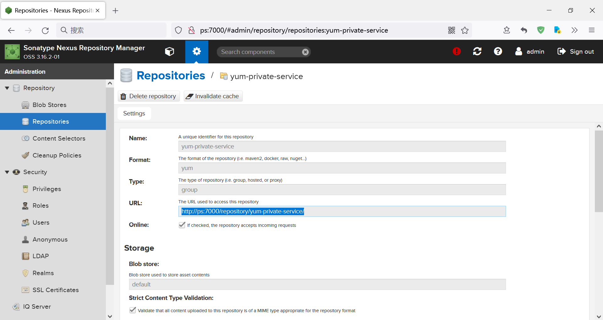

# 摘要


# 实现步骤

## proxy

- centos https://opsx.alibaba.com/centos/
- docker-ce https://download.docker.com/linux/centos/
- kubernetes http://mirrors.aliyun.com/kubernetes/yum/repos/kubernetes-el7-x86_64
- proxy-yum-mirrors.163.com ：http://mirrors.163.com/centos/7/updates/x86_64/ 

## 使用者配置

配置仓库：

```
[private-os]
name=private-os
baseurl=http://ps:7000/repository/centos/\$releasever/os/\$basearch/
enabled=1
gpgcheck=0

[private-updates]
name=private-updates
baseurl=http://ps:7000/repository/centos/\$releasever/updates/\$basearch/
enabled=1
gpgcheck=0

[private-extras]
name=private-extras
baseurl=http://ps:7000/repository/centos/\$releasever/extras/\$basearch/
enabled=1
gpgcheck=0

[private-centosplus]
name=private-centosplus
baseurl=http://ps:7000/repository/centos/\$releasever/centosplus/\$basearch/
enabled=1
gpgcheck=0

[private-configmanagement]
name=private-configmanagement
baseurl=http://ps:7000/repository/centos/\$releasever/configmanagement/\$basearch/ansible-29/
enabled=1
gpgcheck=0

[private-docker-ce]
name=docker-ce
baseurl=http://ps:7000/repository/docker-ce/$releasever/$basearch/stable/
enabled=1
gpgcheck=0

[private-kubernetes]
name=kubernetes
baseurl=http://ps:7000/repository/kubernetes/
enabled=1
gpgcheck=0


```

**baseurl** 不要手写，要从页面上复制：



# 测试

```sh
# 清理缓存
yum clean all 
yum makecache
# 测试是否代理了 docker-ce
sudo yum install -y docker-ce-20.10.7 docker-ce-cli-20.10.7  containerd.io-1.4.6
# 测试是否代理了 kubernetes
sudo yum install -y kubelet-1.20.9 kubeadm-1.20.9 kubectl-1.20.9 --disableexcludes=kubernetes
```


```sh
 yum update --downloadonly --downloaddir=/tmp/ -y
```

# 有效参考

 [nexus3配置Yum源.html](assets\references\nexus3配置Yum源.html) 

 [nexus配置yum私有仓库.html](assets\references\nexus配置yum私有仓库.html) 

